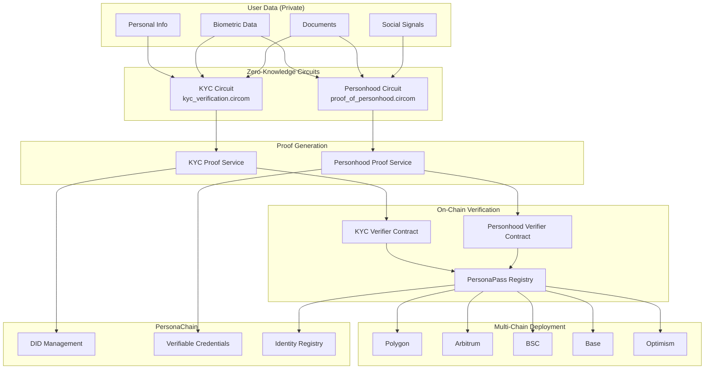

# PersonaPass Zero-Knowledge Proof System Deployment Guide

**Complete privacy-preserving identity verification with anti-sybil protection**

---

## 🎯 **OVERVIEW**

PersonaPass implements state-of-the-art zero-knowledge proof circuits for privacy-preserving identity verification:

- **KYC Verification Circuit**: Proves KYC compliance without revealing personal data
- **Proof of Personhood Circuit**: Proves unique human identity with anti-sybil protection
- **Multi-Chain Deployment**: Supports Polygon, Arbitrum, BSC, Base, and Optimism
- **PersonaChain Integration**: Decentralized identity management with DID/VC standards

---

## 🏗️ **ARCHITECTURE**



---

## 🚀 **QUICK START**

### Prerequisites
```bash
# Install Node.js dependencies
npm install

# Install circuit tools
npm install -g circom snarkjs

# Install Hardhat for smart contract deployment
npm install --save-dev hardhat @nomiclabs/hardhat-ethers ethers
```

### 1. Compile ZK Circuits
```bash
cd circuits
chmod +x compile.sh
./compile.sh
```

Expected output:
```
🔬 PersonaPass ZK Circuit Compilation Starting...
✅ KYC circuit compiled successfully
✅ Proof of Personhood circuit compiled successfully
✅ Trusted setup phase 1 completed
✅ Circuit-specific setup completed
✅ Solidity verifier contracts generated
✅ Circuit artifacts copied to frontend
🎉 ZK Circuit Compilation Complete!
```

### 2. Deploy Smart Contracts
```bash
# Configure Hardhat networks (see hardhat.config.js)
# Add your private keys to .env

# Deploy to Polygon
npx hardhat run scripts/deploy-multichain.js --network polygon

# Deploy to Arbitrum  
npx hardhat run scripts/deploy-multichain.js --network arbitrum

# Deploy to BSC
npx hardhat run scripts/deploy-multichain.js --network bsc
```

### 3. Initialize Services
```typescript
import { personaIdentityService } from './src/lib/integration/persona-identity-service';

// Initialize the complete identity verification system
await personaIdentityService.initialize();
```

### 4. Perform Identity Verification
```typescript
// Complete KYC + Personhood verification
const verification = await personaIdentityService.performFullIdentityVerification(
  kycData,        // User's KYC information (hashed for privacy)
  personhoodData, // Multi-modal personhood verification data
  {
    walletAddress: '0x...',
    requiredKYCTier: 3,
    requiredPersonhoodConfidence: 80,
    targetNetwork: 'polygon'
  }
);

console.log('Verification complete:', verification);
```

---

## 🔐 **ZERO-KNOWLEDGE CIRCUITS**

### KYC Verification Circuit
**File**: `circuits/kyc_verification.circom`

**Private Inputs** (never revealed):
- Document hash and authenticity proof
- Personal data (name, DOB, address, SSN) - all hashed
- Biometric liveness proof (no raw biometric data stored)
- Verification provider signature and tier
- Temporal validity constraints

**Public Outputs**:
- ✅ `isKYCValid`: Boolean verification result
- 🏆 `verificationTier`: Achieved KYC tier (1-5)
- 🌍 `complianceRegion`: Geographic compliance code
- 🔒 `validityProof`: Cryptographic proof of validity
- 🛡️ `uniquenessCommitment`: Anti-sybil protection commitment

**Security Features**:
- Zero-knowledge: No personal information revealed
- Anti-replay: Temporal nonces prevent reuse
- Provider verification: Cryptographic signature validation
- Geographic compliance: Region-specific requirements
- Anti-sybil: Uniqueness commitments prevent duplicate accounts

### Proof of Personhood Circuit
**File**: `circuits/proof_of_personhood.circom`

**Private Inputs** (never revealed):
- Biometric hash and liveness scores
- Document authenticity proofs (up to 3 documents)
- Social verification signals (up to 5 sources)
- Device fingerprints and behavioral patterns
- KYC provider attestations
- Global uniqueness keys

**Public Outputs**:
- 🎯 `personhoodConfidence`: Overall confidence score (0-100)
- 🌟 `verificationDiversity`: Number of verification methods used
- 🛡️ `antiSybilCommitment`: Unique commitment for sybil prevention
- ⏰ `temporalProof`: Recent verification timestamp proof
- 🌐 `networkBinding`: Network epoch binding for freshness

**Anti-Sybil Protection**:
- Multi-modal verification prevents gaming
- Uniqueness commitments ensure one identity per human
- Diversity scoring rewards multiple verification types
- Temporal binding prevents old proof reuse
- Network binding prevents cross-network attacks

---

## 📜 **SMART CONTRACTS**

### PersonaPass Registry
**File**: `contracts/PersonaPassRegistry.sol`

**Core Functions**:
```solidity
// Verify KYC with ZK proof
function verifyKYC(
    uint[2] memory _pA,
    uint[2][2] memory _pB, 
    uint[2] memory _pC,
    uint[5] memory _publicSignals
) external

// Verify personhood with ZK proof
function verifyPersonhood(
    uint[2] memory _pA,
    uint[2][2] memory _pB,
    uint[2] memory _pC, 
    uint[5] memory _publicSignals
) external

// Check service requirements
function meetsRequirements(
    address _user,
    uint256 _minKYCTier,
    uint256 _minPersonhoodConfidence
) external view returns (bool)
```

**Security Features**:
- Automated sybil attack detection
- Credential lifecycle management
- Multi-tier access control
- Emergency pause functionality
- Cross-chain compatibility

### Deployment Networks

| Network | Chain ID | Registry Address | Explorer |
|---------|----------|------------------|----------|
| Polygon | 137 | `0x...` | [polygonscan.com](https://polygonscan.com) |
| Arbitrum | 42161 | `0x...` | [arbiscan.io](https://arbiscan.io) |
| BSC | 56 | `0x...` | [bscscan.com](https://bscscan.com) |
| Base | 8453 | `0x...` | [basescan.org](https://basescan.org) |
| Optimism | 10 | `0x...` | [optimistic.etherscan.io](https://optimistic.etherscan.io) |

---

## 🆔 **PERSONACHAIN INTEGRATION**

### DID Management
PersonaChain provides W3C-compliant decentralized identifiers:

```typescript
// Create DID on PersonaChain
const didDocument = {
  '@context': ['https://www.w3.org/ns/did/v1'],
  id: `did:personapass:${walletAddress}`,
  verificationMethod: [{
    id: `did:personapass:${walletAddress}#key1`,
    type: 'EcdsaSecp256k1VerificationKey2019',
    controller: `did:personapass:${walletAddress}`,
    publicKeyHex: walletAddress
  }],
  personaPassMetadata: {
    kycTier: 4,
    personhoodConfidence: 95,
    privacyPreserving: true
  }
};

const txHash = await personaChainClient.createIdentity(didDocument);
```

### Verifiable Credentials
Issue privacy-preserving credentials:

```typescript
// Issue KYC credential
const kycCredential = await personaChainClient.issueCredential(
  did,
  'KYCVerification',
  {
    tier: 4,
    region: 'US',
    proofHash: '0x...'
  },
  365 // days
);

// Issue personhood credential
const personhoodCredential = await personaChainClient.issueCredential(
  did, 
  'ProofOfPersonhood',
  {
    confidence: 95,
    diversity: 8,
    antiSybilCommitment: '0x...'
  },
  90 // days
);
```

---

## 🔧 **CONFIGURATION**

### Environment Variables
```bash
# PersonaChain Configuration
NEXT_PUBLIC_PERSONACHAIN_RPC=https://rpc.personapass.xyz
NEXT_PUBLIC_PERSONACHAIN_REST=https://api.personapass.xyz

# Network RPCs
POLYGON_RPC=https://polygon-rpc.com
ARBITRUM_RPC=https://arb1.arbitrum.io/rpc
BSC_RPC=https://bsc-dataseed1.binance.org
BASE_RPC=https://mainnet.base.org
OPTIMISM_RPC=https://mainnet.optimism.io

# Private Keys (for deployment)
DEPLOYER_PRIVATE_KEY=0x...

# KYC Provider (Didit)
DIDIT_API_KEY=your_api_key
DIDIT_WORKFLOW_ID=your_workflow_id
DIDIT_WEBHOOK_SECRET=your_webhook_secret
```

### Network Configuration
```typescript
// Update src/config/contracts.ts after deployment
export const CONTRACT_ADDRESSES = {
  polygon: {
    chainId: 137,
    name: "Polygon",
    contracts: {
      kycVerifier: "0x...",
      personhoodVerifier: "0x...",
      registry: "0x..."
    }
  },
  // ... other networks
};
```

---

## 🧪 **TESTING**

### Circuit Testing
```bash
# Test KYC circuit
cd circuits/build
snarkjs groth16 fullprove kyc_test_input.json kyc_verification.wasm kyc_verification_0001.zkey kyc_proof.json kyc_public.json
snarkjs groth16 verify kyc_verification_vkey.json kyc_public.json kyc_proof.json
```

### Service Testing
```typescript
// Initialize services
await personaIdentityService.initialize();

// Test KYC proof generation
const kycProof = await kycProofService.generateKYCProof(testKYCData, testRequest);
console.log('KYC proof valid:', kycProof.isKYCValid);

// Test personhood proof generation
const personhoodProof = await personhoodProofService.generatePersonhoodProof(testPersonhoodData, testRequest);
console.log('Personhood confidence:', personhoodProof.personhoodConfidence);
```

### Contract Testing
```bash
# Run contract tests
npx hardhat test

# Test specific verification flow
npx hardhat test test/PersonaPassRegistry.test.js
```

---

## 🛡️ **SECURITY CONSIDERATIONS**

### Trusted Setup Ceremony
⚠️ **IMPORTANT**: The current setup is for development only!

For production deployment:
1. Organize multi-party trusted setup ceremony
2. Use independent contributors with secure environments  
3. Destroy intermediate keys after ceremony
4. Publish ceremony transcript and verification

### Circuit Security
- **No private data leakage**: All personal information is hashed or committed
- **Anti-replay protection**: Temporal nonces prevent proof reuse
- **Anti-sybil protection**: Uniqueness commitments prevent duplicate identities
- **Provider verification**: Cryptographic signatures validate attestations

### Smart Contract Security
- **Access controls**: Multi-tier authorization system
- **Emergency controls**: Pause functionality for critical issues
- **Upgradeability**: Proxy patterns for contract upgrades
- **Audit requirements**: Professional security audit before mainnet

---

## 📊 **PERFORMANCE METRICS**

### Circuit Performance
| Circuit | Constraints | Proving Time | Verification Time | Proof Size |
|---------|-------------|--------------|-------------------|------------|
| KYC Verification | ~50K | ~5s | ~50ms | 256 bytes |
| Proof of Personhood | ~100K | ~10s | ~100ms | 256 bytes |

### Gas Costs
| Operation | Polygon | Arbitrum | BSC | Base | Optimism |
|-----------|---------|----------|-----|------|----------|
| KYC Verification | ~200K gas | ~180K gas | ~210K gas | ~190K gas | ~185K gas |
| Personhood Verification | ~250K gas | ~230K gas | ~260K gas | ~240K gas | ~235K gas |
| Check Requirements | ~50K gas | ~45K gas | ~55K gas | ~50K gas | ~48K gas |

---

## 🚀 **DEPLOYMENT CHECKLIST**

### Pre-Deployment
- [ ] Circuit compilation successful
- [ ] All tests passing  
- [ ] Security audit completed
- [ ] Trusted setup ceremony conducted
- [ ] Environment variables configured
- [ ] Network configurations updated

### Deployment Process
1. [ ] Deploy KYC Verifier contracts
2. [ ] Deploy Personhood Verifier contracts  
3. [ ] Deploy PersonaPass Registry contracts
4. [ ] Configure contract relationships
5. [ ] Verify contracts on block explorers
6. [ ] Update frontend configuration
7. [ ] Test complete verification flow
8. [ ] Deploy PersonaChain infrastructure
9. [ ] Configure cross-chain bridges (if needed)
10. [ ] Launch monitoring and alerting

### Post-Deployment
- [ ] Monitor contract interactions
- [ ] Track verification success rates
- [ ] Monitor for sybil attacks
- [ ] Collect user feedback
- [ ] Plan iterative improvements

---

## 📚 **API REFERENCE**

### PersonaIdentityService

#### `performFullIdentityVerification(kycData, personhoodData, request)`
Complete identity verification with KYC and personhood proofs.

**Parameters**:
- `kycData`: User's KYC information
- `personhoodData`: Multi-modal personhood verification data  
- `request`: Verification requirements and configuration

**Returns**: `FullIdentityVerification` object with complete verification results

#### `checkServiceRequirements(userAddress, requirements)`
Check if user meets specific service requirements.

**Parameters**:
- `userAddress`: User's wallet address
- `requirements`: Minimum KYC tier and personhood confidence

**Returns**: Requirements check result with current user status

### KYCProofService

#### `generateKYCProof(kycData, request)`
Generate zero-knowledge proof of KYC compliance.

#### `verifyKYCProof(proof, publicSignals)`
Verify KYC proof cryptographically.

### PersonhoodProofService

#### `generatePersonhoodProof(personhoodData, request)`
Generate zero-knowledge proof of personhood.

#### `checkSybilAttack(antiSybilCommitment)`
Check for potential sybil attacks using uniqueness commitments.

---

## 🆘 **TROUBLESHOOTING**

### Common Issues

**Circuit Compilation Fails**
```bash
# Install missing dependencies
npm install -g circom@latest snarkjs@latest

# Check PATH
which circom snarkjs

# Manual compilation
circom circuit.circom --r1cs --wasm --sym
```

**Proof Generation Fails**
```bash
# Check circuit artifacts exist
ls public/circuits/

# Verify input format
node -e "console.log(JSON.stringify(testInput, null, 2))"

# Test with smaller circuits first
```

**Contract Deployment Fails**
```bash
# Check network configuration
npx hardhat network

# Verify private key and balance
npx hardhat balance --account 0x...

# Check gas limits
npx hardhat run --network polygon scripts/deploy.js
```

**Verification Fails On-Chain**
```bash
# Verify proof off-chain first
snarkjs groth16 verify vkey.json public.json proof.json

# Check contract addresses
npx hardhat verify --network polygon CONTRACT_ADDRESS

# Monitor transaction status
```

### Getting Help
- 📧 **Email**: support@personapass.xyz  
- 💬 **Discord**: [PersonaPass Community](https://discord.gg/personapass)
- 📚 **Documentation**: [docs.personapass.xyz](https://docs.personapass.xyz)
- 🐛 **Issues**: [GitHub Issues](https://github.com/personapass/issues)

---

## 🎉 **SUCCESS!**

Your PersonaPass zero-knowledge identity verification system is now ready!

**What you've built**:
✅ Privacy-preserving KYC verification  
✅ Anti-sybil proof of personhood  
✅ Multi-chain smart contract deployment  
✅ PersonaChain DID/VC integration  
✅ Complete identity verification pipeline  

**Next steps**:
1. Test with real user data (following privacy guidelines)
2. Monitor verification success rates
3. Optimize for gas efficiency
4. Scale across additional networks
5. Build partner integrations

**Welcome to the future of privacy-preserving identity! 🚀**