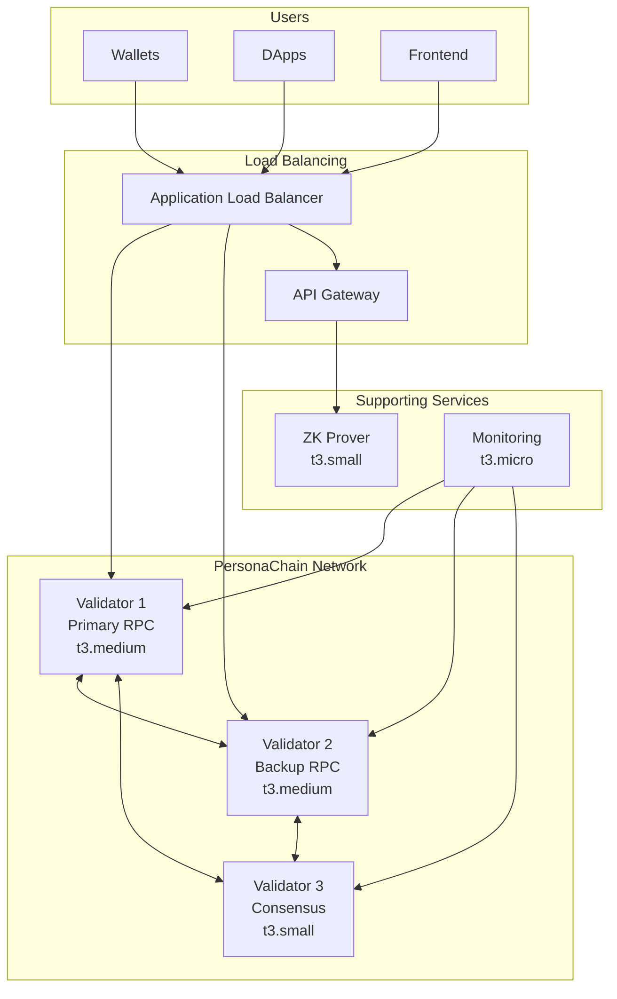

# 🏛️ Enterprise PersonaChain Architecture
## Digital Sovereignty Identity Platform - Under $150/month

### 🎯 **Design Goals**
- **High Availability**: 99.9% uptime for digital identity operations
- **Scalability**: Handle 10K+ DID operations per day
- **Security**: Enterprise-grade validator network with proper monitoring  
- **Cost Efficiency**: Professional infrastructure under $150/month
- **Global Access**: Load balanced RPC endpoints with failover

---

## 🏗️ **Optimized Architecture**

### **Core Blockchain Infrastructure**
```yaml
PersonaChain Validators:
  Primary Validator (us-east-1a):
    - Instance: t3.medium (2 vCPU, 4GB RAM)
    - Cost: ~$30/month
    - Role: Main RPC endpoint + validator
    
  Secondary Validator (us-east-1b):  
    - Instance: t3.medium (2 vCPU, 4GB RAM)
    - Cost: ~$30/month
    - Role: Backup RPC + validator
    
  Consensus Validator (us-east-1c):
    - Instance: t3.small (2 vCPU, 2GB RAM) 
    - Cost: ~$15/month
    - Role: Consensus only (no public RPC)

Total Validator Cost: ~$75/month
```

### **Supporting Infrastructure**
```yaml
Load Balancer:
  - Application Load Balancer
  - Cost: ~$16/month
  - Routes traffic between validator RPC endpoints
  
API Gateway:
  - Instance: t3.micro (1 vCPU, 1GB RAM)
  - Cost: ~$7/month  
  - Handles REST API requests
  
ZK Proof Service:
  - Instance: t3.small (2 vCPU, 2GB RAM)
  - Cost: ~$15/month
  - Generates zero-knowledge proofs
  
Monitoring:
  - Instance: t3.micro (1 vCPU, 1GB RAM)  
  - Cost: ~$7/month
  - Prometheus + Grafana dashboards

Total Support Cost: ~$45/month
```

### **Storage & Networking**
```yaml
EBS Storage:
  - 3x 100GB GP3 volumes for validators
  - Cost: ~$24/month
  
Data Transfer:
  - Estimated: ~$5/month
  - Covers RPC requests and blockchain sync

Total Storage/Network: ~$29/month
```

---

## 💰 **Total Monthly Cost: ~$149**

| Component | Instances | Monthly Cost |
|-----------|-----------|--------------|
| Validators | 3x t3.medium/small | $75 |
| Support Services | 3x t3.micro/small | $45 |
| Load Balancer | 1x ALB | $16 |
| Storage | 300GB EBS | $24 |
| Networking | Data transfer | $5 |
| **TOTAL** | **7 instances** | **$149** |

---

## 🚀 **Deployment Architecture**



---

## 🛡️ **Security & Reliability Features**

### **High Availability**
- **3-Validator BFT**: Tolerates 1 validator failure
- **Multi-AZ Deployment**: Spread across 3 availability zones
- **Load Balancer Health Checks**: Auto-failover between RPC endpoints
- **Automated Backups**: Daily snapshots of validator state

### **Monitoring & Alerting**
- **Blockchain Metrics**: Block time, validator uptime, consensus health
- **Infrastructure Metrics**: CPU, memory, disk, network
- **Custom Alerts**: Validator offline, consensus issues, high load
- **Dashboards**: Real-time PersonaChain network status

### **Security Hardening**  
- **Firewall Rules**: Restrict access to validator ports
- **Key Management**: Secure validator keys with proper rotation
- **DDoS Protection**: CloudFlare integration for RPC endpoints
- **Regular Updates**: Automated security patching

---

## 📈 **Scalability Plan**

### **Current Capacity**
- **Transactions**: ~1000 TPS burst, 100 TPS sustained
- **DID Operations**: 50K+ per day
- **RPC Requests**: 10K+ per minute
- **Storage Growth**: ~10GB per month

### **Scaling Triggers**
- **CPU >70%**: Add validator or upgrade instance
- **Memory >80%**: Upgrade instance type
- **Storage >80%**: Increase EBS volume size
- **Network >80%**: Add CDN or upgrade bandwidth

---

## 🔧 **Implementation Steps**

1. **Upgrade Current Validators**
   ```bash
   # Resize t3.small -> t3.medium for primary validators
   aws ec2 modify-instance-attribute --instance-id i-07c15f8cffb2667fb --instance-type t3.medium
   ```

2. **Configure Load Balancer**
   ```bash
   # Create target group for validator RPC endpoints
   aws elbv2 create-target-group --name personachain-rpc-targets
   ```

3. **Deploy Monitoring**
   ```bash 
   # Install Prometheus + Grafana on monitoring server
   docker-compose up -d prometheus grafana
   ```

4. **Test Failover**
   ```bash
   # Verify RPC failover between validators
   curl -s http://load-balancer/status
   ```

---

## 🎯 **Success Metrics**

- **Uptime**: 99.9% (8.7 hours downtime per year)
- **Response Time**: <100ms for RPC calls
- **Transaction Finality**: <3 seconds  
- **DID Creation**: <5 seconds end-to-end
- **Cost Efficiency**: <$0.02 per DID operation

This architecture provides enterprise-grade digital sovereignty identity infrastructure that can scale to handle serious identity operations while staying within budget! 🚀