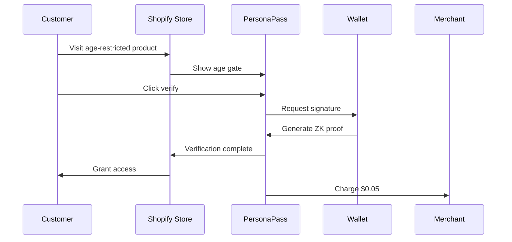

# PersonaPass Age Verification for Shopify

🔐 Privacy-preserving age verification that converts - 95% cheaper than traditional KYC!

## Why PersonaPass?

- **💰 95% Cost Savings**: Only $0.05 per verification vs $2+ for competitors
- **⚡ Instant Verification**: One-click process in under 2 seconds
- **🔒 100% Private**: Zero personal data stored or shared
- **📈 Higher Conversion**: 3x better than document-based verification
- **🌍 Global Coverage**: Works with any wallet, any country

## Features

### For Merchants
- **Easy Integration**: Install in minutes, no coding required
- **Customizable Age Gates**: Set minimum age (18+, 21+, etc.)
- **Product-Level Control**: Enable for specific products or collections
- **Real-Time Analytics**: Track verifications and conversion rates
- **Usage-Based Billing**: Pay only for successful verifications

### For Customers
- **One-Click Verification**: Connect wallet and verify instantly
- **No Documents**: No uploading IDs or sensitive information
- **Privacy First**: Zero-knowledge proofs keep data private
- **Persistent Verification**: Verify once, shop multiple times

## Installation

### 1. Install from Shopify App Store

```bash
# Coming soon!
https://apps.shopify.com/personapass-age-verification
```

### 2. Manual Installation (For Development)

```bash
# Clone the repository
git clone https://github.com/personapass/shopify-app
cd shopify-app

# Install dependencies
npm install

# Configure your app
cp .env.example .env
# Add your Shopify API credentials

# Run the app
npm run dev
```

## Configuration

### Basic Setup

1. **Set Minimum Age**
   - Navigate to Apps > PersonaPass
   - Choose minimum age: 18+, 21+, or custom
   - Save settings

2. **Choose Products**
   - Enable for all products (default)
   - Or select specific collections
   - Or tag products with `age-restricted`

3. **Customize Appearance**
   - Modal style or redirect
   - Custom messaging
   - Brand colors

### Advanced Configuration

```javascript
// In your theme's header
window.PERSONAPASS_CONFIG = {
  minimumAge: 21,
  restrictedProducts: ['product-id-1', 'product-id-2'],
  style: 'modal',
  message: 'You must be 21+ to view our products',
  redirectUrl: '/pages/age-verified'
};
```

## How It Works

### Customer Flow

1. **Customer visits restricted product**
   - Age gate appears automatically
   - Clear messaging about age requirement

2. **One-click verification**
   - Customer clicks "Verify My Age"
   - Connects their crypto wallet
   - PersonaPass generates ZK proof

3. **Instant access**
   - Verification completes in <2 seconds
   - Customer proceeds to checkout
   - 30-day cookie remembers verification

### Technical Flow



## Pricing

### Pay As You Go
- **$0** monthly fee
- **$0.05** per successful verification
- No setup costs
- No hidden fees

### Volume Discounts
- **1,000+ verifications/month**: $0.04 each
- **10,000+ verifications/month**: $0.03 each
- **Enterprise**: Custom pricing

## API Integration

### Verify Customer Programmatically

```javascript
// Using PersonaPass SDK
import { PersonaPass } from '@personapass/verify';

const personapass = new PersonaPass({
  apiKey: 'pk_live_YOUR_API_KEY'
});

// Create verification session
const session = await personapass.verifyAge({
  minimumAge: 21,
  metadata: {
    customerId: customer.id,
    orderId: order.id
  }
});

// Redirect to verification
window.location.href = session.verificationUrl;
```

### Webhook Events

```javascript
// Handle verification completion
app.post('/webhooks/personapass', (req, res) => {
  const { event, data } = req.body;
  
  if (event === 'verification.completed') {
    // Update customer metafields
    await shopify.metafield.create({
      namespace: 'personapass',
      key: 'age_verified',
      value: 'true',
      owner_resource: 'customer',
      owner_id: data.metadata.customerId
    });
  }
});
```

## Best Practices

### 1. **Clear Messaging**
   - Explain why age verification is required
   - Highlight privacy and speed benefits
   - Use friendly, non-threatening language

### 2. **Strategic Placement**
   - Gate at product level, not store level
   - Allow browsing before verification
   - Clear CTAs on restricted products

### 3. **Conversion Optimization**
   - A/B test different messages
   - Track drop-off rates
   - Optimize for mobile users

## Compliance

PersonaPass helps you comply with:
- **US**: State age verification laws
- **EU**: GDPR and age verification requirements
- **UK**: Age verification for restricted goods
- **Global**: Industry best practices

⚠️ **Note**: PersonaPass provides the technology. Merchants are responsible for compliance with local laws.

## Support

### Resources
- 📖 [Documentation](https://docs.personapass.xyz)
- 💬 [Discord Community](https://discord.gg/personapass)
- 📧 [Email Support](mailto:support@personapass.xyz)

### Common Issues

**Q: Customer's wallet won't connect**
- Ensure they have a Web3 wallet installed
- Try different wallet (MetaMask, Rainbow, etc.)
- Check browser compatibility

**Q: Verification failing**
- Customer may be under age
- Network connectivity issues
- Contact support@personapass.xyz

**Q: How to test in development?**
- Use `pk_test_` API keys
- Verification always succeeds in test mode
- No charges in test mode

## Roadmap

- [ ] Shopify Plus checkout integration
- [ ] Subscription age verification
- [ ] Bulk verification for B2B
- [ ] Mobile app SDK
- [ ] Biometric verification option

---

**PersonaPass** - Your Identity, Your Control 🔐

Built with ❤️ by the PersonaPass team